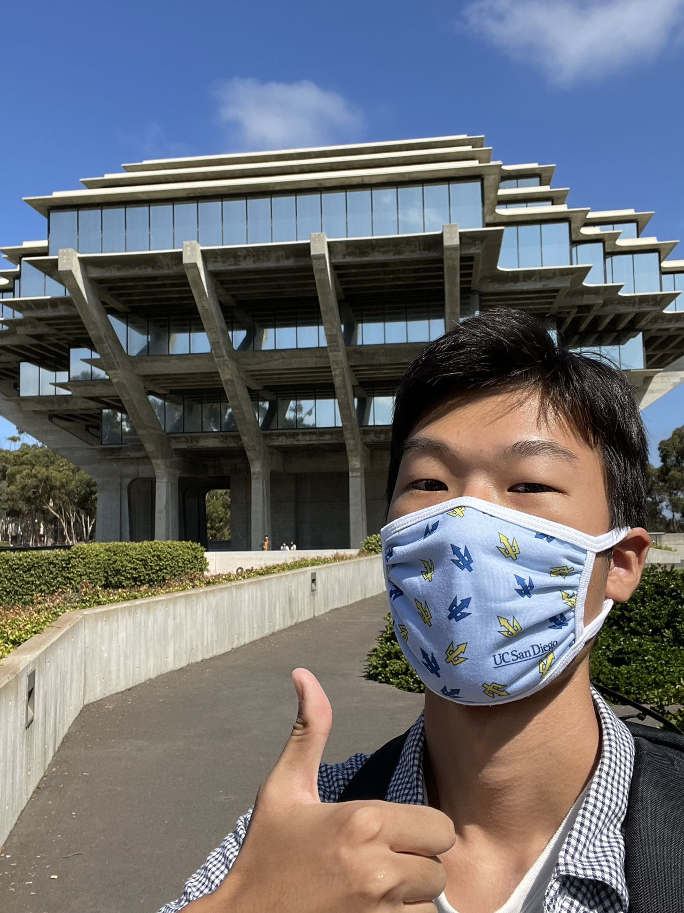

# Frank Li

## Basic Information
**Second-year Math-CS student in ERC**
> To be, or not to be, that is the question. 

## As a Programmer
I have learned the following programming languages
- C
* C++
+ Java 
I started with Java. Here is the first code I wrote: `System.out.print("Hello World!");`

Here are my goals for this course:
- [ ] Join a team and work with others as a team
- [ ] Learn the process of making a project from scratch
- [ ] Introduce my project to others

## Personal Life
I like to play video games and listen to music.  
[Dream Theater](https://dreamtheater.net/) is my favorite band so far.  
[I also collected some cds.](/materials/cds.jpg)
